# EXAMEN TIPO TEST — Historia del Arte de los Pueblos Primitivos

**Instrucciones:** Cada pregunta tiene una sola respuesta correcta (A, B, C o D). Las imágenes están tomadas de las diapositivas de la asignatura (*Pueblos Primitivos*). El solucionario está al final del documento.

**Total: 40 preguntas.**

> Bloques: África subsahariana (preguntas 1–28) y Oceanía (preguntas 29–40).

---

## BLOQUE I — ÁFRICA SUBSAHARIANA

### Pregunta 1

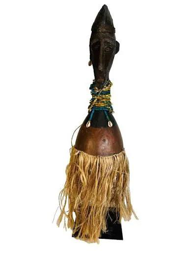

Este "fetiche" M'Bwoolo, activado por el *nganga* mediante la introducción de sustancias mágicas (*bilongo*), pertenece a la cultura:

- A) Fang
- B) Yaka (R. D. del Congo y Angola)
- C) Dogon
- D) Yoruba

---

### Pregunta 2

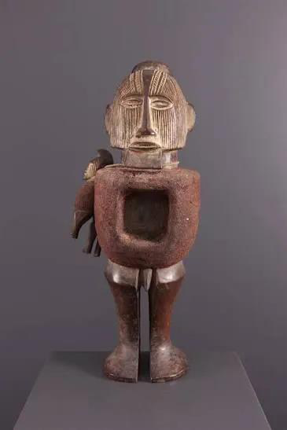

¿A qué cultura del Congo pertenece este fetiche?

- A) Teke
- B) Senufo
- C) Mende
- D) Asante

---

### Pregunta 3

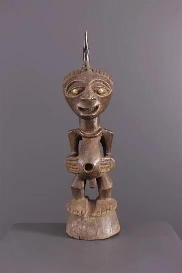

Este fetiche, en cuya cabeza puede portar la carga mágica, pertenece a la cultura:

- A) Pende
- B) Songye (El Congo)
- C) Bamana
- D) Dan

---

### Pregunta 4

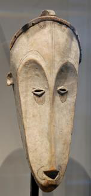

Esta máscara Ngil, coloreada de caolín blanco y vinculada a la **justicia y el orden social**, pertenece a la etnia:

- A) Fang (Gabón)
- B) Pende
- C) Lobi
- D) Mossi

---

### Pregunta 5

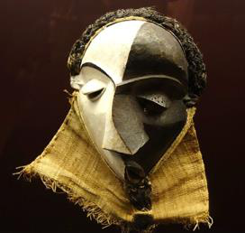

Esta máscara Mbangu, caracterizada por la asimetría del rostro y la bicromía blanco/negro (lucha entre el bien y el mal), es una máscara de:

- A) Fertilidad
- B) Guerra
- C) Enfermedad (etnia Pende)
- D) Iniciación

---

### Pregunta 6

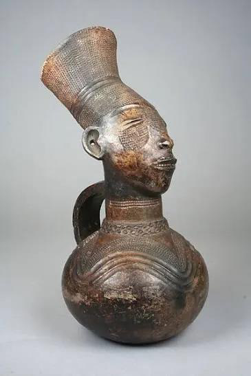

Esta pieza ritual en terracota, rematada por un moño cilíndrico que refleja la deformación craneal como ideal de belleza, corresponde al grupo étnico:

- A) Mangbetu (R. D. del Congo)
- B) Fang
- C) Baulé
- D) Tolai

---

### Pregunta 7

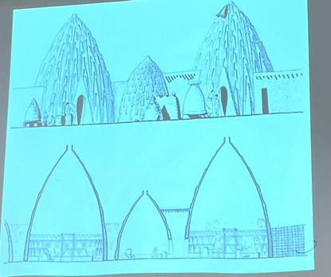

Estas cabañas de barro de planta circular y alzado cónico (tipología *tolke*), rematadas por un óculo y con nervios en forma de V, pertenecen a la etnia:

- A) Dogon
- B) Musgum (Camerún)
- C) Senufo
- D) Bamana

---

### Pregunta 8

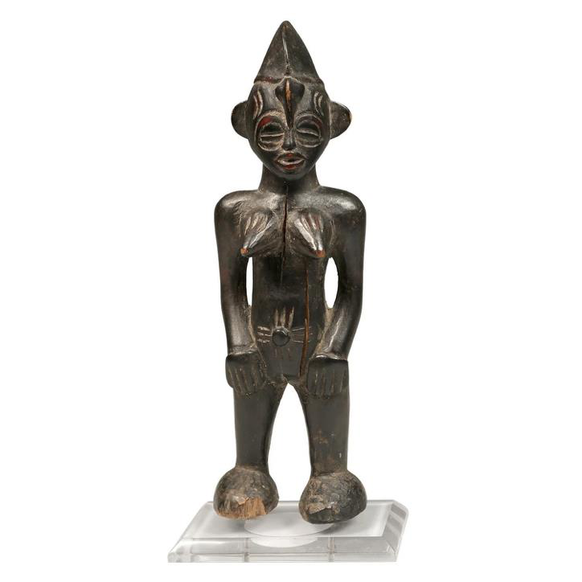

Estas estatuillas votivas Tugubele, usadas por adivinos para comunicarse con los espíritus de la naturaleza, pertenecen al pueblo:

- A) Senufo (Costa de Marfil)
- B) Fon
- C) Igbo
- D) Mende

---

### Pregunta 9

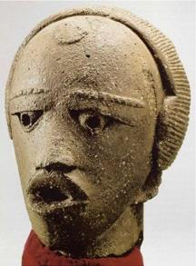

Esta cabeza en terracota pertenece a la **cultura Nok** de Nigeria. ¿Cuál es su marco cronológico?

- A) Siglo XV–XVI d.C.
- B) Desde el 1000 a.C. hasta el 500 d.C.
- C) Siglo XVII–XIX
- D) Siglo III a.C. al siglo I d.C.

---

### Pregunta 10

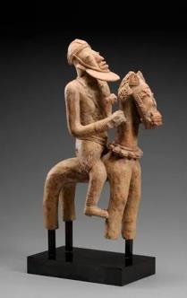

Esta figura en terracota pertenece a la cultura Djenne-Djeno. ¿En qué actual país se localiza?

- A) Nigeria
- B) Malí
- C) Ghana
- D) Gabón

---

### Pregunta 11

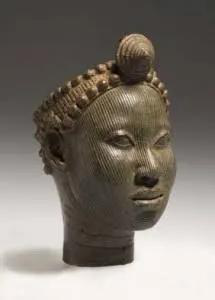

Esta cabeza, vinculada a los reyes sagrados *oni*, pertenece al Reino de:

- A) Benín
- B) Dahomey
- C) Ife (Nigeria)
- D) Asante

---

### Pregunta 12

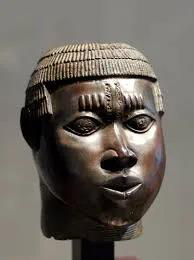

Estas cabezas conmemorativas de los reyes **Oba**, cuyo mayor esplendor se dio en los siglos XV y XVI, pertenecen al Reino de:

- A) Ife
- B) Benín (Nigeria)
- C) Dahomey
- D) Nok

---

### Pregunta 13

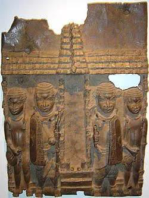

Estas placas conmemorativas (siglos XVI–XVII) del Reino de Benín están realizadas principalmente en:

- A) Bronce
- B) Terracota
- C) Marfil
- D) Oro

---

### Pregunta 14

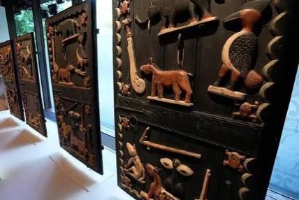

Esta figura del dios de la guerra Gou (Gu), realizada en hierro, pertenece al Reino de:

- A) Ife
- B) Asante
- C) Dahomey (pueblo Fon)
- D) Benín

---

### Pregunta 15

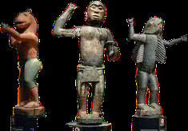

Este *asen* o altar portátil pertenece al pueblo:

- A) Fon (Reino de Dahomey)
- B) Yoruba
- C) Dan
- D) Kota

---

### Pregunta 16

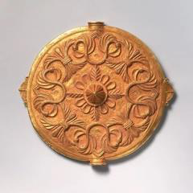

Estas muñecas de la fertilidad *akuaba* y los discos de oro pertenecen al Reino:

- A) Asante / Ashanti (Ghana), capital Kumasi
- B) Benín
- C) Ife
- D) Dahomey

---

### Pregunta 17

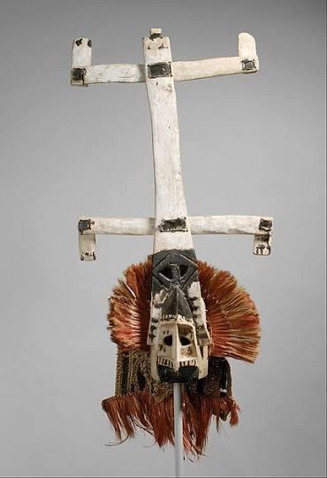

Esta máscara Kanaga, ligada al culto a los antepasados y al transporte de las almas (Mascarada de *Dama*), pertenece a la etnia:

- A) Bamana
- B) Dogon (Malí)
- C) Bwa
- D) Mende

---

### Pregunta 18

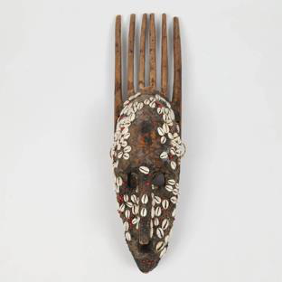

Esta máscara cimera Ci Wara (Chi Wara), de fertilidad, pertenece a la etnia:

- A) Dogon
- B) Bamana (Malí)
- C) Senufo
- D) Lobi

---

### Pregunta 19

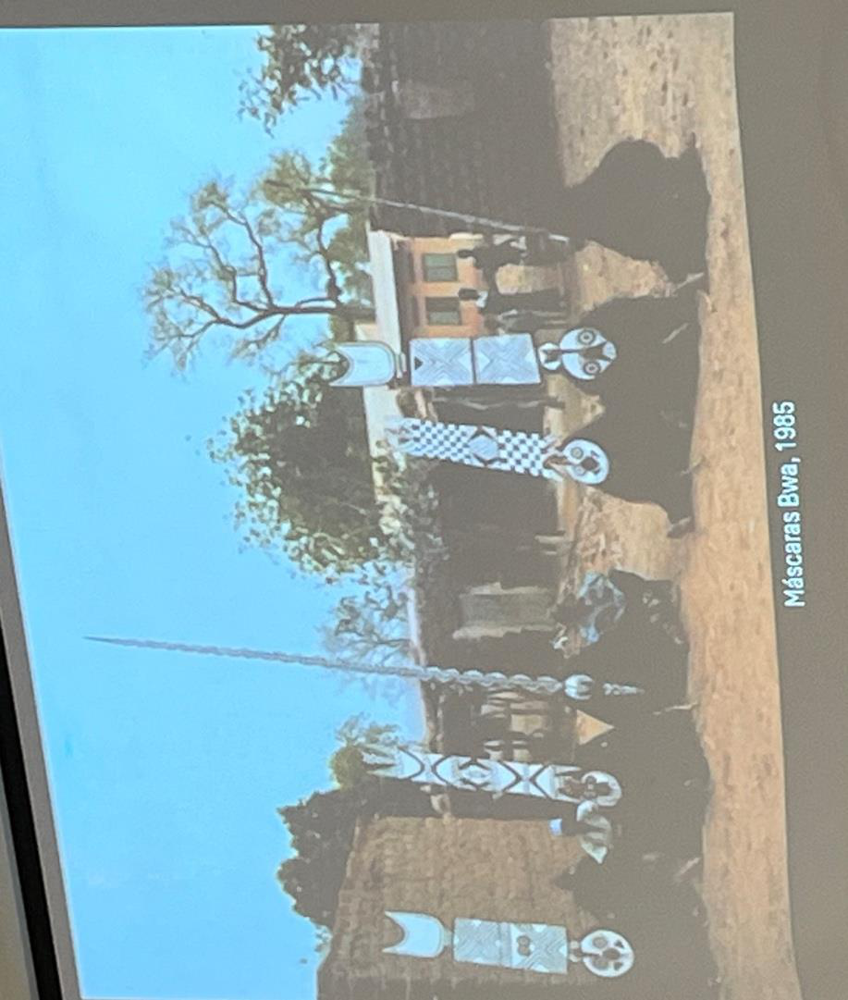

Estas máscaras (verticales u horizontales) destinadas a la fertilidad y a alejar los malos espíritus pertenecen a los Bwa, Nunuma y afines. ¿En qué país se localizan?

- A) Burkina Faso
- B) Sierra Leona
- C) Gabón
- D) Angola

---

### Pregunta 20

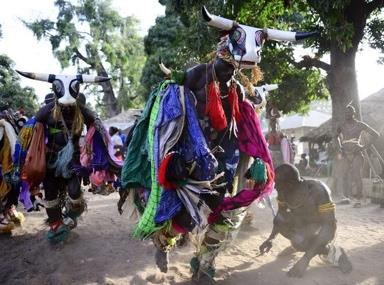

Estos objetos rituales de iniciación de la comunidad Bigyodo, que habita las islas Bissagos, se localizan en:

- A) Guinea-Bisáu
- B) Nigeria
- C) Malí
- D) Camerún

---

### Pregunta 21

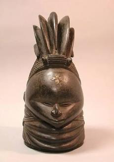

Esta máscara-casco Bundu o Sowei, usada por las mujeres de la sociedad secreta **Sande**, pertenece a los Mende. ¿En qué país?

- A) Costa de Marfil
- B) Sierra Leona
- C) Ghana
- D) Togo

---

### Pregunta 22

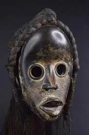

Estas máscaras *gunyega* (de corredor o de carreras), de función lúdica, pertenecen a la etnia:

- A) Dan (Costa de Marfil y Liberia)
- B) Gouro
- C) We-Gueré
- D) Baulé

---

### Pregunta 23

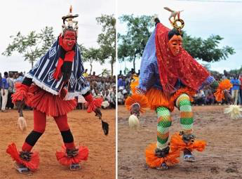

La danza/máscara Zaouli y las máscaras Zamble, asociadas al entretenimiento y al turismo (máscaras profanas), pertenecen a la etnia:

- A) Gouro (Costa de Marfil)
- B) Dan
- C) Mende
- D) Igbo

---

### Pregunta 24

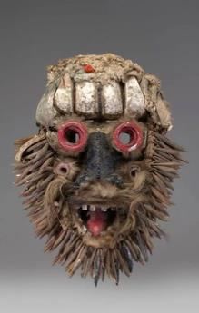

Estas máscaras de guerra, con rasgos humanos y animales, destinadas a establecer el orden social y la justicia, pertenecen a la etnia:

- A) We-Gueré (Costa de Marfil)
- B) Dan
- C) Fang
- D) Bamana

---

### Pregunta 25

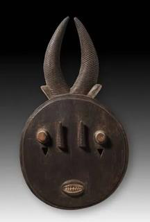

Estas máscaras espectáculo de Goli (*kple-kple*, Goli Glen, Kpan), de exquisita delicadeza, pertenecen a la etnia:

- A) Baulé (Costa de Marfil)
- B) Senufo
- C) Yoruba
- D) Mossi

---

### Pregunta 26

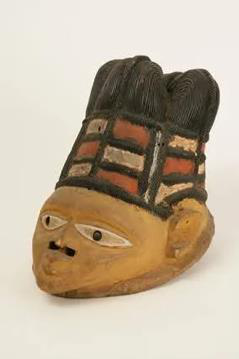

Esta máscara-casco *gelede*, asociada a la paz en la tierra y a la "madre primordial", pertenece a la etnia:

- A) Igbo
- B) Yoruba (Nigeria)
- C) Dan
- D) Fon

---

### Pregunta 27

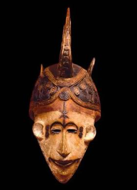

Esta máscara Agbogho Mmwo, ligada a la "fiesta anual de las doncellas", pertenece a la etnia:

- A) Igbo (Nigeria)
- B) Yoruba
- C) Baulé
- D) Mende

---

### Pregunta 28

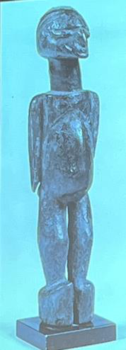

Estas figuras *bateba*, colocadas en altares (*thilduu*) para que los espíritus se encarnen y den protección, pertenecen a la etnia:

- A) Lobi (Burkina Faso, Costa de Marfil y Ghana)
- B) Dogon
- C) Mossi
- D) Senufo

---

## (Continuación África)

### Pregunta 29

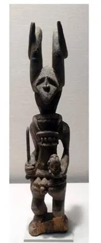

Esta figura *Ikenga*, espíritu de protección del belicoso pueblo Igbo, se asocia al momento en que sus miembros:

- A) Se casan
- B) Nacen
- C) Mueren
- D) Cazan

---

### Pregunta 30

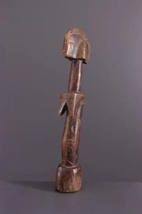

Esta muñeca *Biiga*, vinculada a la fertilidad, pertenece a la etnia:

- A) Mossi (Burkina Faso)
- B) Baulé
- C) Asante
- D) Fon

---

### Pregunta 31

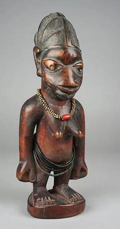

Estas figuras gemelas, talladas tras la muerte de un mellizo, reciben el nombre de *Ibeji* entre los Yoruba. ¿Cómo se denominan entre los Ewe de Togo?

- A) Hohovi
- B) Venavi
- C) Akuaba
- D) Bateba

---

### Pregunta 32

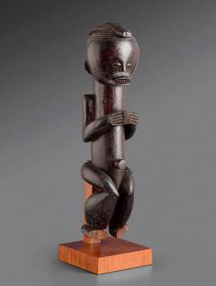

Estas figuras de relicario *Eyema Byeri*, que protegían los huesos de los ancestros, pertenecen a la etnia:

- A) Kota
- B) Fang
- C) Yoruba
- D) Senufo

---

## BLOQUE II — OCEANÍA

### Pregunta 33

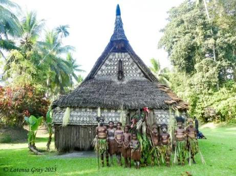

Esta casa ceremonial (*Tambaran*), "casa de los hombres / espíritus" del "pueblo de los hombres cocodrilos", pertenece a la región:

- A) Sepik (Papúa Nueva Guinea)
- B) Asmat
- C) Nueva Irlanda
- D) Islas Marquesas

---

### Pregunta 34

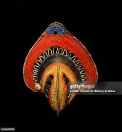

Esta máscara, realizada con técnica de cestería y vinculada al cultivo del ñame, pertenece al pueblo Abelam. ¿Dónde se localiza?

- A) Montañas Maprik, al norte de la cuenca del Sepik
- B) Isla de Pascua
- C) Archipiélago Bismarck
- D) Islas Salomón

---

### Pregunta 35

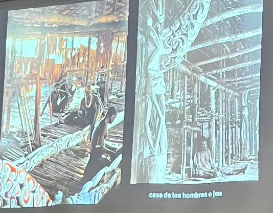

Esta cultura de la zona occidental de Nueva Guinea (Papúa Occidental), dedicada a la recolección del sagú y al culto a los ancestros (*safan*), es:

- A) Asmat
- B) Abelam
- C) Iatmul
- D) Tolai

---

### Pregunta 36

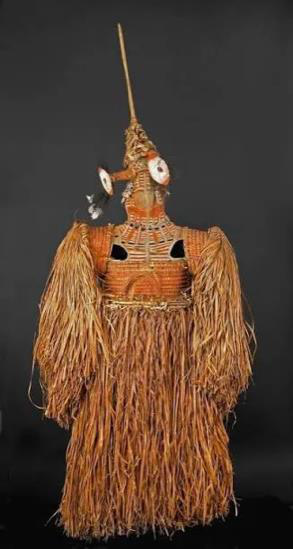

Esta máscara-traje *Jipae*, realizada en cestería para la ceremonia de culto a los ancestros, pertenece a los:

- A) Asmat (Papúa Occidental)
- B) Sepik
- C) Maorí
- D) Malangan

---

### Pregunta 37

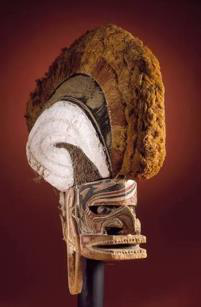

Esta talla pertenece a la cultura Malangan, asociada al mundo de los difuntos y a las fiestas mortuorias. ¿En qué isla?

- A) Nueva Irlanda (Archipiélago Bismarck)
- B) Rapa Nui
- C) Vanuatu
- D) Islas Salomón

---

### Pregunta 38

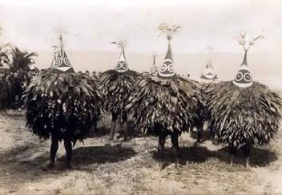

Esta pieza se relaciona con la sociedad **Duk-Duk**, organización ritual y política del pueblo Tolai. ¿En qué isla?

- A) Nueva Bretaña (Archipiélago Bismarck)
- B) Nueva Guinea
- C) Hawái
- D) Isla de Pascua

---

### Pregunta 39

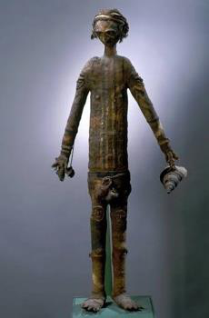

Esta figura funeraria *Rambaramp* pertenece a las Nuevas Hébridas. ¿Cuál es su nombre actual?

- A) Islas Vanuatu
- B) Islas Salomón
- C) Islas Marquesas
- D) Nueva Caledonia

---

### Pregunta 40

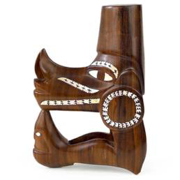

Estas figuras de proa de canoa (*nguzu nguzu* o *musumusu*) pertenecen a:

- A) Islas Salomón
- B) Isla de Pascua
- C) Islas Marquesas
- D) Nueva Guinea

---

### Pregunta 41 (extra)

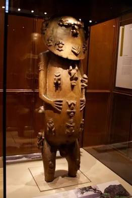

Esta figura divina *A'A*, procedente de la isla de Rurutu (archipiélago Austral), pertenece a la región de Oceanía denominada:

- A) Polinesia
- B) Melanesia
- C) Micronesia
- D) Insulindia

---

### Pregunta 42 (extra)

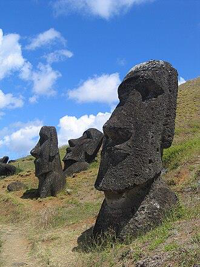

Estos *moai* (cronología del siglo XII a los más recientes del siglo XVII) se encuentran en:

- A) Isla de Pascua / Rapa Nui
- B) Islas Marquesas
- C) Hawái
- D) Nueva Zelanda

---

### Pregunta 43 (extra)

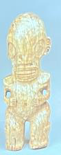

Estas figuras *Tiki* pertenecen a las:

- A) Islas Marquesas
- B) Islas Salomón
- C) Nuevas Hébridas
- D) Islas Bissagos

---

### Pregunta 44 (extra)

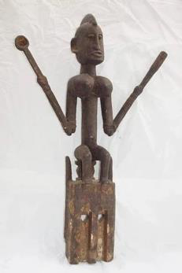

Dentro de las máscaras Dogon, además de la Kanaga, existen otras tipologías. ¿Cuál de las siguientes NO es una máscara Dogon?

- A) Satimbe
- B) Sirige
- C) Kanaga
- D) N'Tomo

---

---

# SOLUCIONARIO

| Nº | Resp. | Justificación |
|----|-------|---------------|
| 1 | **B** | Fetiche M'Bwoolo de la cultura Yaka (R. D. del Congo y Angola). |
| 2 | **A** | Fetiche Teke, El Congo. |
| 3 | **B** | Fetiche Songye, El Congo; puede portar la carga mágica en la cabeza. |
| 4 | **A** | Máscara Ngil, etnia Fang (Gabón), caolín blanco, justicia y orden social. |
| 5 | **C** | Máscara Mbangu de enfermedad, etnia Pende; asimetría y bicromía (bien/mal). |
| 6 | **A** | Jarra/arpa de los Mangbetu (R. D. del Congo); deformación craneal como ideal de belleza. |
| 7 | **B** | Cabañas de barro Musgum (Camerún), tipología *tolke*, óculo y nervios en V. |
| 8 | **A** | Figuras Tugubele del pueblo Senufo (Costa de Marfil). |
| 9 | **B** | Cultura Nok (Nigeria), del 1000 a.C. al 500 d.C. |
| 10 | **B** | Cultura Djenne-Djeno, en Malí (desde el siglo III a.C.). |
| 11 | **C** | Reino de Ife (Nigeria), reyes sagrados *oni*. |
| 12 | **B** | Reino de Benín (Nigeria), cabezas de los reyes Oba; esplendor s. XV–XVI. |
| 13 | **A** | Placas del Reino de Benín en bronce (s. XVI–XVII). |
| 14 | **C** | Dios Gou (Gu), Reino de Dahomey, pueblo Fon; realizado en hierro. |
| 15 | **A** | *Asen* o altar portátil del pueblo Fon (Reino de Dahomey). |
| 16 | **A** | Reino Asante/Ashanti (Ghana), capital Kumasi; *akuaba* y discos de oro. |
| 17 | **B** | Máscara Kanaga, etnia Dogon (Malí); culto a los antepasados, Mascarada de Dama. |
| 18 | **B** | Máscara Ci Wara, etnia Bamana (Malí); máscara cimera de fertilidad. |
| 19 | **A** | Bwa, Nunuma y afines, Burkina Faso. |
| 20 | **A** | Comunidad Bigyodo, islas Bissagos, Guinea-Bisáu. |
| 21 | **B** | Máscara Bundu/Sowei, sociedad Sande, etnia Mende (Sierra Leona). |
| 22 | **A** | Máscaras *gunyega* de corredor, etnia Dan (Costa de Marfil y Liberia). |
| 23 | **A** | Máscaras Zaouli/Zamble, etnia Gouro (Costa de Marfil); profanas. |
| 24 | **A** | Máscaras de guerra We-Gueré (Costa de Marfil); rasgos humanos y animales. |
| 25 | **A** | Máscaras de Goli (kple-kple, Goli Glen, Kpan), etnia Baulé (Costa de Marfil). |
| 26 | **B** | Máscara-casco *gelede*, etnia Yoruba (Nigeria); madre primordial. |
| 27 | **A** | Máscara Agbogho Mmwo, etnia Igbo (Nigeria); fiesta anual de las doncellas. |
| 28 | **A** | Figuras *bateba* en altares *thilduu*, etnia Lobi (Burkina Faso, Costa de Marfil, Ghana). |
| 29 | **A** | *Ikenga* Igbo; los cuernos abstractos se asocian al momento del matrimonio (cuando se casan). |
| 30 | **A** | Muñeca *Biiga* de fertilidad, etnia Mossi (Burkina Faso). |
| 31 | **B** | Gemelos: Yoruba = Ibeji; Ewe (Togo) = Venavi; Fon (Dahomey) = Hohovi. |
| 32 | **B** | Relicario *Eyema Byeri*, etnia Fang (Camerún, Guinea Ecuatorial y Gabón). |
| 33 | **A** | Casa Tambaran, región Sepik (Papúa Nueva Guinea); pueblo de los hombres cocodrilos. |
| 34 | **A** | Máscara Abelam de cestería, montañas Maprik, al norte de la cuenca del Sepik. |
| 35 | **A** | Asmat, Papúa Occidental; recolección del sagú, culto a los ancestros (*safan*). |
| 36 | **A** | Máscara-traje *Jipae*, Asmat; cestería, ceremonia de culto a los ancestros. |
| 37 | **A** | Cultura Malangan, Nueva Irlanda (Archipiélago Bismarck); fiestas mortuorias. |
| 38 | **A** | Sociedad Duk-Duk, pueblo Tolai, Nueva Bretaña (Archipiélago Bismarck). |
| 39 | **A** | *Rambaramp*, Nuevas Hébridas = actuales islas Vanuatu. |
| 40 | **A** | Proas de canoa *nguzu nguzu*/musumusu, Islas Salomón. |
| 41 | **A** | Figura divina *A'A* de Rurutu; región de la Polinesia. |
| 42 | **A** | *Moai* de la Isla de Pascua / Rapa Nui (s. XII–XVII). |
| 43 | **A** | Figuras *Tiki* de las Islas Marquesas. |
| 44 | **D** | N'Tomo es una máscara Bamana, no Dogon. Satimbe, Sirige y Kanaga sí son Dogon. |
