# EXAMEN TIPO TEST — LOCALIZACIÓN (Pueblos Primitivos)

> Segundo examen de práctica, **centrado en la LOCALIZACIÓN geográfica** de las obras (África, Melanesia, Polinesia, América del Norte).
>
> Las imágenes están extraídas de las diapositivas del PPT ("Negritos Pedro PPT"), donde cada obra aparece etiquetada con **Etnia + Localización + Función**. La información se complementa con el temario ("HISTORIA DEL ARTE DE LOS PUEBLOS PRIMITIVOS").
>
> **Cómo usarlo:** cada pregunta tiene 4 opciones. Piensa tu respuesta y luego pulsa en **"▶ Ver respuesta"** para comprobarla.
>
> - **Parte 1 (1–31):** identifica la LOCALIZACIÓN a partir de la imagen.
> - **Parte 2 (32–40):** localización por conceptos (sin imagen).
>
> Total: **40 preguntas**. Plantilla de soluciones al final.

---

## PARTE 1 — Localización a partir de la imagen

### África

### 1. Esta terracota marca el inicio de la Historia del Arte africana (cultura Nok). ¿En qué actual país se localiza?

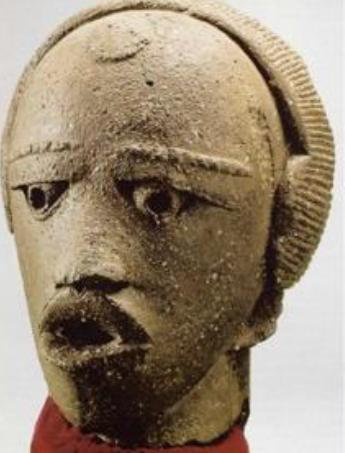

- A) Nigeria
- B) Malí
- C) Ghana
- D) Senegal

▶ Ver respuesta

**Respuesta: A) Nigeria.** La cultura **Nok** se desarrolló en torno a los ríos Níger y Benue (actual Nigeria), ~1000 a.C.–500 d.C. Es la más antigua y marca el inicio de la HdA africana.

---

### 2. Cabeza naturalista de bronce/latón. ¿Dónde se localizaba el reino de Ife?

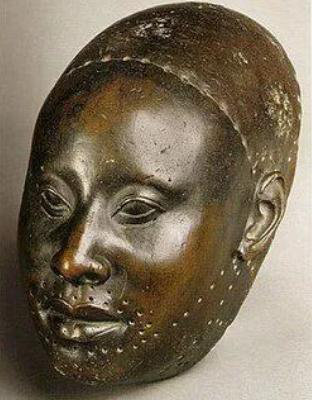

- A) Ghana
- B) Nigeria
- C) Camerún
- D) Costa de Marfil

▶ Ver respuesta

**Respuesta: B) Nigeria.** El reino **Ife** (Yoruba) se localiza en la actual Nigeria. Famoso por sus cabezas naturalistas de latón/bronce.

---

### 3. El "Disco del alma" (Disco de Oro) pertenece a los Ashanti (grupo Akan). ¿En qué país?

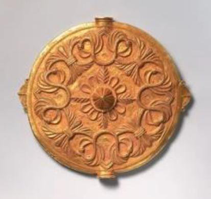

- A) Costa de Marfil
- B) Togo
- C) Ghana
- D) Nigeria

▶ Ver respuesta

**Respuesta: C) Ghana.** Los **Ashanti** (Asante), dentro del grupo **Akan**, se localizan en Ghana.

---

### 4. Máscara blanca Ngil, de justicia y orden social (etnia Fang). La etnia Fang se localiza en…

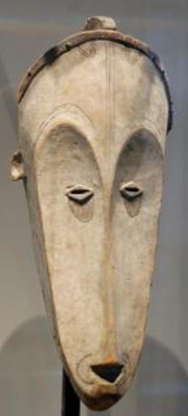

- A) Malí y Níger
- B) RD Congo
- C) Sudáfrica
- D) Gabón, Guinea Ecuatorial y Camerún

▶ Ver respuesta

**Respuesta: D) Gabón, Guinea Ecuatorial y Camerún.** La etnia **Fang** ocupa esta zona ecuatorial. La máscara **Ngil** (blanca = mundo de los ancestros) influyó en *Las señoritas de Avignon* de Picasso.

---

### 5. Este "fetiche" (nkisi) de la etnia Yaka procede de…

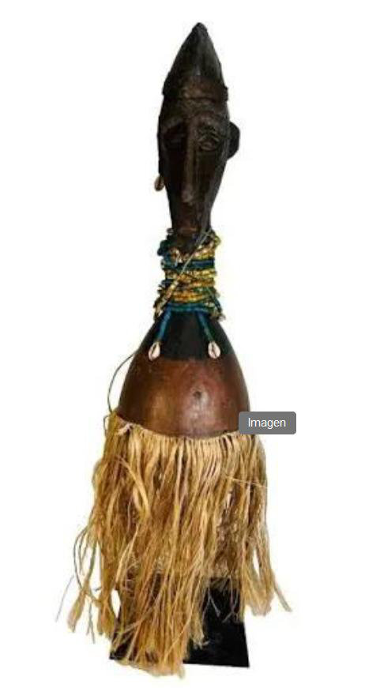

- A) RD Congo
- B) Nigeria
- C) Ghana
- D) Kenia

▶ Ver respuesta

**Respuesta: A) RD Congo.** El "fetiche" (**nkisi/minkisi**) es propio de la cultura Congo. La etnia **Yaka** se localiza en la **República Democrática del Congo (RDC)**.

---

### 6. La Toguna ("casa de la palabra") es de los Dogón, localizados en…

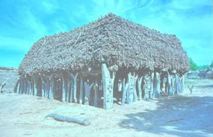

- A) Burkina Faso
- B) Malí
- C) Senegal
- D) Chad

▶ Ver respuesta

**Respuesta: B) Malí.** Los **Dogón** viven en el acantilado de Bandiagara (**Malí**). La *Toguna* es el cobertizo bajo donde debaten los hombres.

---

### 7. La figura de Mami Wata (etnia Ewe) se localiza en…

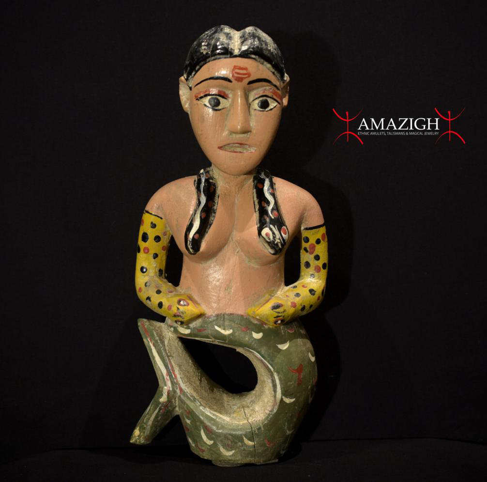

- A) Sudáfrica
- B) Angola
- C) Togo
- D) Etiopía

▶ Ver respuesta

**Respuesta: C) Togo.** **Mami Wata** (deidad acuática) entre los **Ewe** de **Togo**; también presente en los Fon de Benín.

---

### 8. La máscara Bundu/Sowei (la única máscara africana usada por mujeres) es de los Mende de…

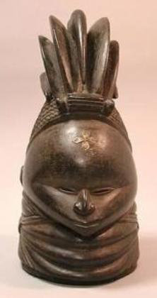

- A) Liberia
- B) Malí
- C) Guinea
- D) Sierra Leona

▶ Ver respuesta

**Respuesta: D) Sierra Leona.** La máscara **Bundu/Sowei** de la sociedad **Sande** (etnia **Mende**) procede de **Sierra Leona**. Función: rito de iniciación femenino.

---

### 9. La máscara-danza Zaouli (etnia Gouro), de función lúdica, procede de…

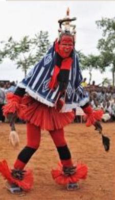

- A) Costa de Marfil
- B) Ghana
- C) Nigeria
- D) Benín

▶ Ver respuesta

**Respuesta: A) Costa de Marfil.** La máscara **Zaouli** de los **Gouro** es de **Costa de Marfil**.

---

### 10. Esta vivienda de barro (estilo obús/tolek), de los Musgum, se localiza en…

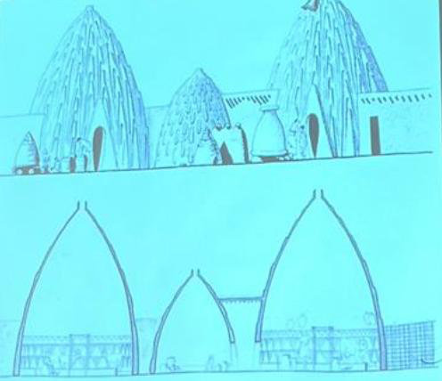

- A) Sudán
- B) Camerún
- C) Malí
- D) Nigeria

▶ Ver respuesta

**Respuesta: B) Camerún.** Las viviendas cónicas de barro de los **Musgum** son de **Camerún**.

---

### 11. Estas máscaras de tablón (Bwa / Nunuma), para ritos de cosecha, proceden de…

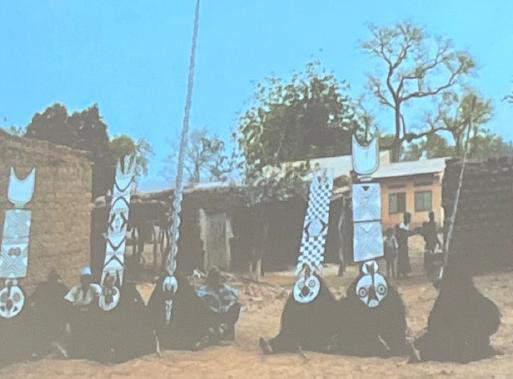

- A) Costa de Marfil
- B) Senegal
- C) Burkina Faso
- D) Ghana

▶ Ver respuesta

**Respuesta: C) Burkina Faso.** Las máscaras **Bwa/Nunuma** (geométricas, de tablón) son de **Burkina Faso**.

---

### Melanesia

### 12. La Casa Tambarán ("casa de los hombres / de los espíritus") del río Sepik se ubica en…

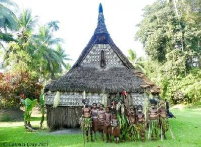

- A) Polinesia
- B) Micronesia
- C) Australia
- D) Papúa Nueva Guinea (Melanesia)

▶ Ver respuesta

**Respuesta: D) Papúa Nueva Guinea (Melanesia).** La **Casa Tambarán** está en la región del **río Sepik**, Papúa Nueva Guinea.

---

### 13. Los postes Bisj (culto a los ancestros) de los Asmat se localizan en…

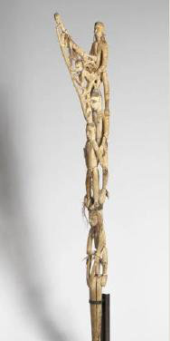

- A) Papúa Occidental (Melanesia)
- B) Islas Marquesas
- C) Rapa Nui
- D) Nueva Zelanda

▶ Ver respuesta

**Respuesta: A) Papúa Occidental (Melanesia).** Los **Asmat** habitan en **Papúa Occidental** (Nueva Guinea). Los **postes Bisj** conmemoran a los muertos.

---

### 14. Estas tallas Malangan (máscara Tatanua), de función funeraria, proceden de…

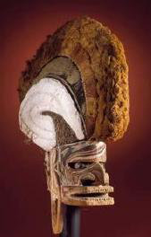

- A) Hawái
- B) Nueva Irlanda (Archipiélago de Bismarck)
- C) Tahití
- D) Borneo

▶ Ver respuesta

**Respuesta: B) Nueva Irlanda (Archipiélago de Bismarck).** El arte **Malangan** (ceremonias funerarias) es de **Nueva Irlanda**, en el archipiélago de Bismarck (Melanesia).

---

### 15. Los trajes-máscara Duk-Duk (pueblo Tolai) son de…

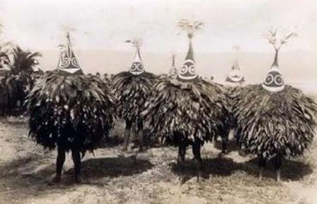

- A) Isla de Pascua
- B) Samoa
- C) Nueva Bretaña (Archipiélago de Bismarck)
- D) Java

▶ Ver respuesta

**Respuesta: C) Nueva Bretaña (Archipiélago de Bismarck).** Los **Duk-Duk** (pueblo **Tolai**) son de **Nueva Bretaña** (Melanesia).

---

### 16. Estas figuras funerarias Rambaramp proceden del archipiélago de…

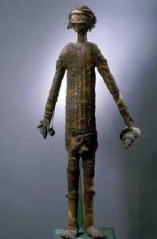

- A) Islas Hawái
- B) Islas Cook
- C) Islas Marquesas
- D) Vanuatu (Nuevas Hébridas)

▶ Ver respuesta

**Respuesta: D) Vanuatu (Nuevas Hébridas).** Las figuras **Rambaramp** (que incorporan el cráneo del difunto) son de **Vanuatu** (Melanesia).

---

### 17. Estas proas de canoa Nguzu-Nguzu (Musumusu) pertenecen a las…

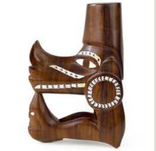

- A) Islas Salomón
- B) Islas Aleutianas
- C) Islas Australes
- D) Islas Andamán

▶ Ver respuesta

**Respuesta: A) Islas Salomón.** Las figuras de proa **Nguzu-Nguzu** protegían las canoas de las **Islas Salomón** (Melanesia).

---

### 18. La máscara ceremonial Abelam se localiza en…

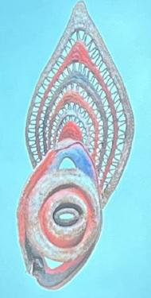

- A) Polinesia
- B) Papúa Nueva Guinea (Melanesia)
- C) Norte de América
- D) África Occidental

▶ Ver respuesta

**Respuesta: B) Papúa Nueva Guinea (Melanesia).** La etnia **Abelam** se localiza en Papúa Nueva Guinea.

---

### Polinesia

### 19. Estas figuras monumentales con "pukao" (moai) se localizan en…

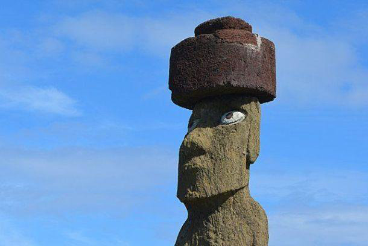

- A) Islas Marquesas
- B) Hawái
- C) Rapa Nui (Isla de Pascua)
- D) Nueva Zelanda

▶ Ver respuesta

**Respuesta: C) Rapa Nui (Isla de Pascua).** Los **moai** (con *pukao* o tocado) se tallaban en la cantera de **Rano Raraku**, en **Rapa Nui** (Polinesia).

---

### 20. Estas figuras Tiki son características (en origen) de las…

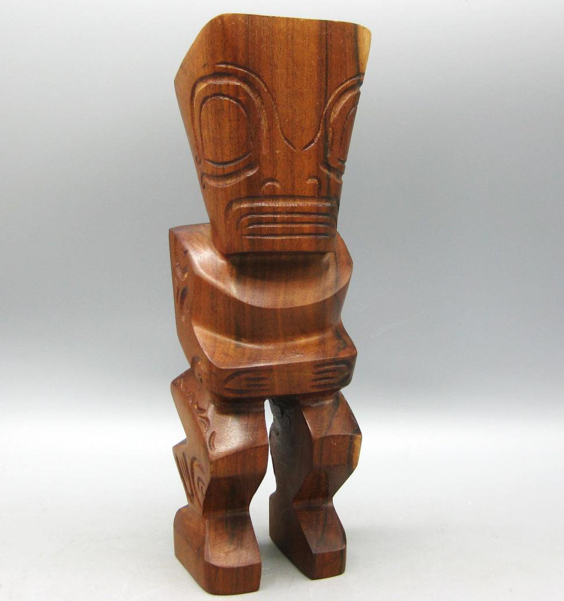

- A) Islas Salomón
- B) Islas Aleutianas
- C) Nueva Irlanda
- D) Islas Marquesas

▶ Ver respuesta

**Respuesta: D) Islas Marquesas.** Los **Tiki** proceden de las **Islas Marquesas**, aunque están presentes por toda la Polinesia.

---

### 21. Esta célebre figura (A'A) procede de Rurutu, en el archipiélago de las… (Polinesia)

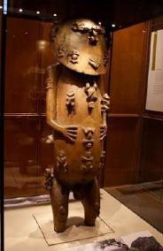

- A) Australes
- B) Bismarck
- C) Aleutianas
- D) Antillas

▶ Ver respuesta

**Respuesta: A) Australes.** La figura **A'A**, de Rurutu, pertenece al **archipiélago de las Australes** (Polinesia). Función devocional.

---

### América del Norte

### 22. Estas cabezas de arpón en marfil pertenecen a los Inuit, de la región…

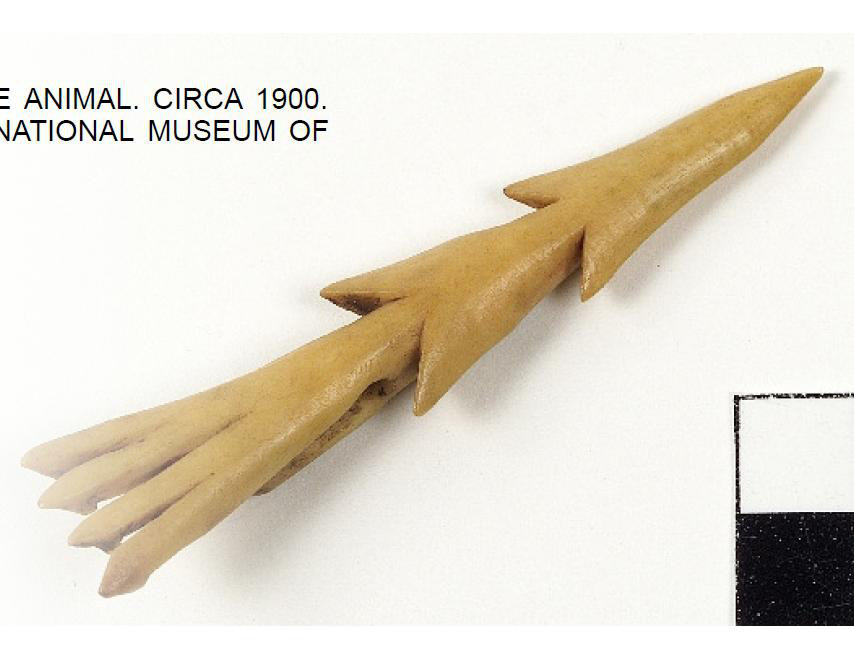

- A) del Suroeste
- B) Ártica (Norte de América)
- C) de las Praderas
- D) de la Costa Noroeste

▶ Ver respuesta

**Respuesta: B) Ártica (Norte de América).** Los **Inuit** habitan el **Ártico**. El arpón (caza de mamíferos marinos) es su utensilio característico.

---

### 23. El iglú (igluviak) es la vivienda de invierno de los…

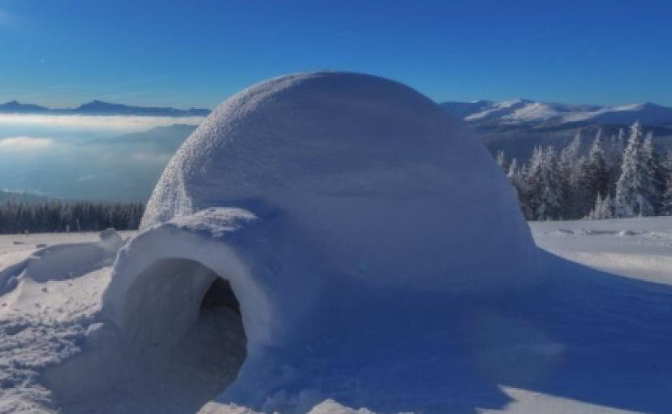

- A) Navajo
- B) Apache
- C) Inuit (Ártico)
- D) Hopi

▶ Ver respuesta

**Respuesta: C) Inuit (Ártico).** El **iglú** de bloques de nieve es vivienda de invierno de los **Inuit**.

---

### 24. La máscara Swaixwe (etnia Salish) pertenece a la cultura de la…

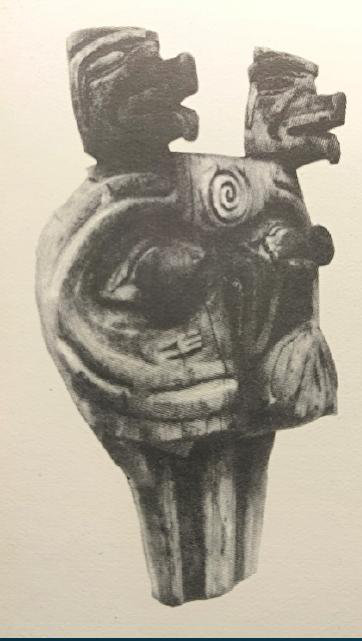

- A) región Ártica
- B) Praderas
- C) Suroeste
- D) Costa Noroeste

▶ Ver respuesta

**Respuesta: D) Costa Noroeste.** Los **Salish** pertenecen a la cultura de la **Costa Noroeste** de Norteamérica.

---

### 25. Las máscaras de transformación articuladas son típicas de los Kwakiutl, de la…

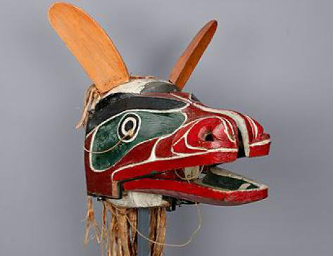

- A) Costa Noroeste
- B) Grandes Llanuras
- C) región Ártica
- D) Suroeste

▶ Ver respuesta

**Respuesta: A) Costa Noroeste.** Los **Kwakiutl** (Costa Noroeste) hacían **máscaras de transformación** que se abren para revelar otra identidad.

---

### 26. Estos grandes postes tallados (tótems) son característicos de los Haida, en la…

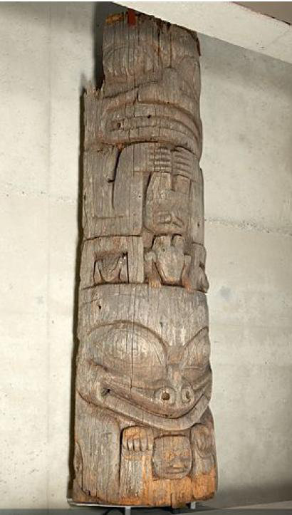

- A) Suroeste
- B) Costa Noroeste
- C) región Ártica
- D) Praderas

▶ Ver respuesta

**Respuesta: B) Costa Noroeste.** Los **tótems** son propios de los **Haida** y demás pueblos de la **Costa Noroeste**.

---

### 27. Estas figuras Kachina de los Hopi (Indios Pueblo) se localizan en el…

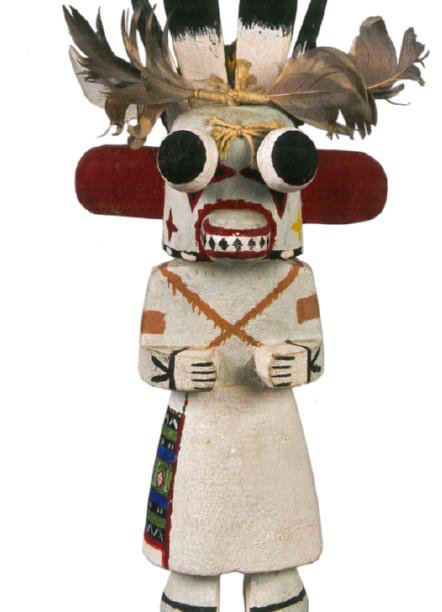

- A) Noroeste
- B) Ártico
- C) Suroeste
- D) Praderas

▶ Ver respuesta

**Respuesta: C) Suroeste.** Las **Kachina** de los **Hopi** (Indios Pueblo) pertenecen al **Suroeste** de Norteamérica.

---

### 28. El Hogan, vivienda ceremonial de los Navajo, se localiza en el…

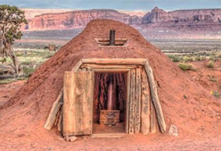

- A) Costa Noroeste
- B) región Ártica
- C) Centro/Praderas
- D) Suroeste

▶ Ver respuesta

**Respuesta: D) Suroeste.** El **Hogan** de los **Navajo** se localiza en el **Suroeste** de Norteamérica.

---

### 29. La máscara Gan (rito de iniciación femenina) de los Apache pertenece al…

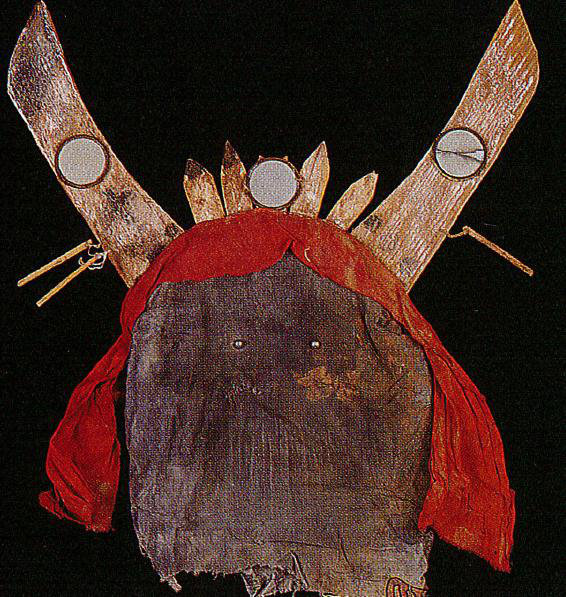

- A) Suroeste
- B) Noroeste
- C) Praderas
- D) Ártico

▶ Ver respuesta

**Respuesta: A) Suroeste.** Los **Apache** pertenecen al **Suroeste** de Norteamérica. La máscara **Gan** participa en el rito de iniciación femenina.

---

### 30. Estas casas de tierra (Earth Lodges) y los tipis son viviendas de los Indios de las…

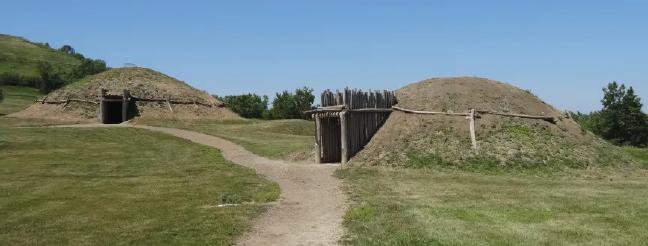

- A) Costa Noroeste
- B) Praderas / Grandes Llanuras (Centro)
- C) región Ártica
- D) Suroeste

▶ Ver respuesta

**Respuesta: B) Praderas / Grandes Llanuras (Centro).** Las **Earth Lodges** y los **tipis** son viviendas de los **Indios de las Praderas** (zona central de Norteamérica).

---

### 31. Este gran tocado de plumas (símbolo de autoridad y estatus) pertenece a los Indios de las…

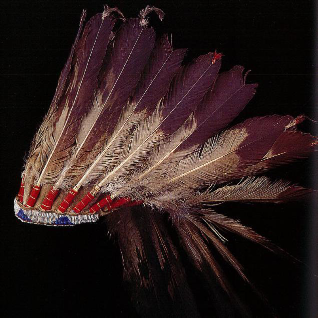

- A) Melanesia
- B) región Ártica
- C) Praderas (Grandes Llanuras)
- D) Suroeste

▶ Ver respuesta

**Respuesta: C) Praderas (Grandes Llanuras).** El **tocado de plumas** (war bonnet) es símbolo de autoridad entre los **Indios de las Praderas**.

---

## PARTE 2 — Localización por conceptos (sin imagen)

### 32. La Isla de Pascua (Rapa Nui), las Islas Marquesas y las Islas Australes pertenecen a…

- A) Melanesia
- B) Micronesia
- C) Insulindia
- D) Polinesia

▶ Ver respuesta

**Respuesta: D) Polinesia.** La **Polinesia** es el gran triángulo que incluye Rapa Nui, Marquesas, Australes, Hawái y Nueva Zelanda.

---

### 33. Papúa Nueva Guinea, el archipiélago de Bismarck, las Islas Salomón y Vanuatu forman parte de…

- A) Melanesia
- B) Polinesia
- C) Micronesia
- D) Indochina

▶ Ver respuesta

**Respuesta: A) Melanesia.** **Melanesia** agrupa Nueva Guinea, archipiélago de Bismarck (Nueva Irlanda, Nueva Bretaña), Islas Salomón y Vanuatu.

---

### 34. Los Inuit se distribuyen principalmente por la región cultural…

- A) del Suroeste
- B) Ártica (Norte de América)
- C) de las Praderas
- D) de la Costa Noroeste

▶ Ver respuesta

**Respuesta: B) Ártica (Norte de América).** Los **Inuit** ocupan las zonas árticas de Norteamérica (y Groenlandia).

---

### 35. Los Indios Pueblo (Hopi, Zuñi), Navajo y Apache habitan en la región cultural del…

- A) Ártico
- B) Costa Noroeste
- C) Suroeste de Norteamérica
- D) las Praderas

▶ Ver respuesta

**Respuesta: C) Suroeste de Norteamérica.** **Hopi, Zuñi, Navajo y Apache** son pueblos del **Suroeste** (zona árida, agricultura, cerámica, kachinas).

---

### 36. Haida, Kwakiutl, Tlingit, Salish y Nootka son pueblos de la…

- A) región Ártica
- B) Praderas
- C) Polinesia
- D) Costa Noroeste

▶ Ver respuesta

**Respuesta: D) Costa Noroeste.** Estos pueblos (tótems, máscaras de transformación, potlatch) son de la **Costa Noroeste** de Norteamérica.

---

### 37. El bisonte, el tipi y el gran tocado de plumas se asocian a los indios de…

- A) las Praderas / Grandes Llanuras
- B) la Costa Noroeste
- C) el Ártico
- D) el Suroeste

▶ Ver respuesta

**Respuesta: A) las Praderas / Grandes Llanuras.** Cultura nómada del bisonte: **tipi**, tocado de plumas, sacos espirituales.

---

### 38. Los reinos de Ife y Benín, y la cultura Nok, se localizan en el actual…

- A) Ghana
- B) Nigeria
- C) Malí
- D) Camerún

▶ Ver respuesta

**Respuesta: B) Nigeria.** **Nok, Ife y Benín** se localizan en la actual **Nigeria**.

---

### 39. Las culturas Dogón y Djenné(-Djeno) se sitúan en…

- A) Burkina Faso
- B) Nigeria
- C) Malí
- D) Costa de Marfil

▶ Ver respuesta

**Respuesta: C) Malí.** Tanto los **Dogón** (Bandiagara) como la cultura **Djenné** se localizan en **Malí**.

---

### 40. El moai es a Rapa Nui lo que la Casa Tambarán es a…

- A) las Islas Marquesas
- B) la región Ártica
- C) Ghana
- D) el río Sepik (Papúa Nueva Guinea, Melanesia)

▶ Ver respuesta

**Respuesta: D) el río Sepik (Papúa Nueva Guinea, Melanesia).** La **Casa Tambarán** es el edificio ceremonial de la región del **Sepik** (Melanesia).

---

## ✅ Plantilla de soluciones

| Preg. | Resp. | Preg. | Resp. | Preg. | Resp. | Preg. | Resp. |
|------|-------|------|-------|------|-------|------|-------|
| 1 | A | 11 | C | 21 | A | 31 | C |
| 2 | B | 12 | D | 22 | B | 32 | D |
| 3 | C | 13 | A | 23 | C | 33 | A |
| 4 | D | 14 | B | 24 | D | 34 | B |
| 5 | A | 15 | C | 25 | A | 35 | C |
| 6 | B | 16 | D | 26 | B | 36 | D |
| 7 | C | 17 | A | 27 | C | 37 | A |
| 8 | D | 18 | B | 28 | D | 38 | B |
| 9 | A | 19 | C | 29 | A | 39 | C |
| 10 | B | 20 | D | 30 | B | 40 | D |

**Distribución:** A=10 · B=10 · C=10 · D=10
