# EXAMEN TIPO TEST — Historia del Arte de los Pueblos Primitivos

> Examen de práctica con **imágenes extraídas de las diapositivas** ("PUEBLOS PRIMITIVOS") y contenido del temario ("HISTORIA DEL ARTE DE LOS PUEBLOS PRIMITIVOS").
>
> **Cómo usarlo:** cada pregunta tiene 4 opciones. Piensa tu respuesta y luego pulsa en **"▶ Ver respuesta"** para comprobarla. Las respuestas están ocultas para que puedas autoevaluarte.
>
> - **Parte 1 (1–18):** reconocimiento de obras a partir de imágenes.
> - **Parte 2 (19–45):** preguntas de conceptos y contenido.
>
> Total: **45 preguntas**. Plantilla de soluciones al final.

---

## PARTE 1 — Identificación visual

### 1. ¿A qué cultura pertenece esta pieza de terracota, considerada el inicio de la Historia del Arte africana?

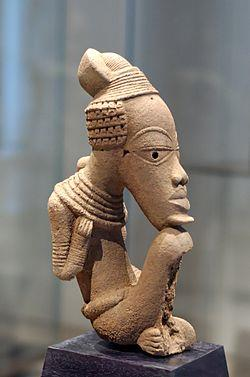

- A) Reino de Benín
- B) Cultura Djenné-Djeno
- C) Cultura Nok
- D) Cultura Ife

▶ Ver respuesta

**Respuesta: C) Cultura Nok** (Nigeria, ríos Níger y Benue; ~1000 a.C.–500 d.C.). Es la cultura más antigua y marca el inicio de la HdA africana. Característica: **ojos en triángulo invertido con pupila incisa**, rasgo que heredarán los Yoruba. Estudioso: Bernard Fagg.

---

### 2. Esta cabeza de bronce procede de un reino donde el rey llevaba el título de *Oba*. ¿De qué reino se trata?

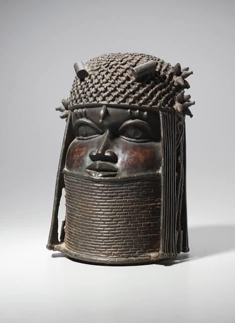

- A) Reino de Ife
- B) Reino de Benín (etnia Edo)
- C) Reino Asante
- D) Reino de Dahomey

▶ Ver respuesta

**Respuesta: B) Reino de Benín** (Nigeria, etnia **Edo**). Rey = **Oba**; inicio s. XIII, esplendor s. XV–XVI. Famoso por sus **cabezas y placas de bronce**. El **marfil** era material **exclusivo del Oba**.

---

### 3. Este objeto con una cavidad en el vientre para introducir una carga mágica es un "fetiche". ¿De qué pueblo/zona es característico?

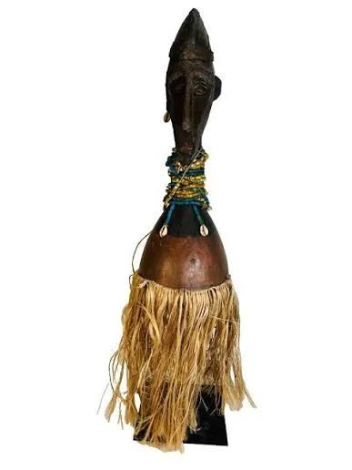

- A) Dogon (Malí)
- B) Fang (Gabón)
- C) Senufo (Costa de Marfil)
- D) Yaka (Congo)

▶ Ver respuesta

**Respuesta: D) Yaka (Congo)**. El nombre real del "fetiche" es **nkisi (pl. minkisi)**, propio de la cultura **Congo** (Yaka, Teke, Songye). Lo crean dos personas: el **escultor** (talla) y el **Nganga** (introduce el *bilongo* / medicina que lo activa).

---

### 4. Esta máscara blanca de función judicial y de orden social pertenece a la etnia Fang. ¿Cómo se llama?

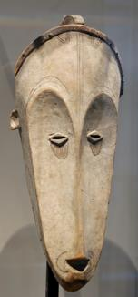

- A) Máscara Ngil
- B) Máscara Kanaga
- C) Máscara Gelede
- D) Máscara Mbangu

▶ Ver respuesta

**Respuesta: A) Máscara Ngil** (etnia **Fang**, Gabón). De **justicia y orden social**. El color **blanco** remite al mundo de los **ancestros**. Influyó en *Las señoritas de Avignon* de Picasso.

---

### 5. Esta máscara de rostro asimétrico/deformado representa la enfermedad y es propia del pueblo Pende. ¿Cuál es?

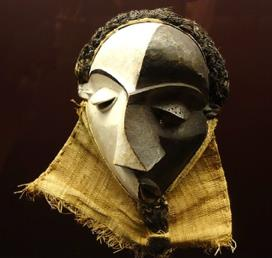

- A) Máscara N'Tomo
- B) Máscara Zaouli
- C) Máscara Mbangu
- D) Máscara Bundu

▶ Ver respuesta

**Respuesta: C) Máscara Mbangu** (etnia **Pende**, República Democrática del Congo). Es una **máscara de enfermedad** (rostro deformado/asimétrico). Picasso se inspiró en la **asimetría de las máscaras Pende**.

---

### 6. Esta máscara con una doble cruz (motivo de "cruz de Lorena"/axis mundi) es de la etnia Dogon. ¿Cuál es su nombre?

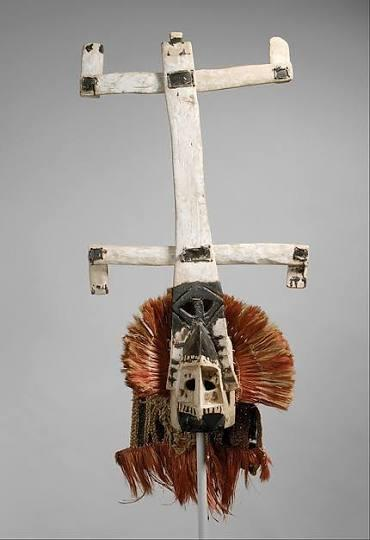

- A) Máscara Satimbe
- B) Máscara Kanaga
- C) Máscara Sirige
- D) Máscara Ci Wara

▶ Ver respuesta

**Respuesta: B) Máscara Kanaga** (etnia **Dogon**, Malí). Se usa en la **mascarada de Dama** (culto a los antepasados); la doble cruz se interpreta como **axis mundi** (dios Amma) y sirve para **transportar las almas**.

---

### 7. Esta máscara de formas geométricas, propia de Burkina Faso, sirve para la fertilidad y para alejar malos espíritus. ¿De qué pueblo es?

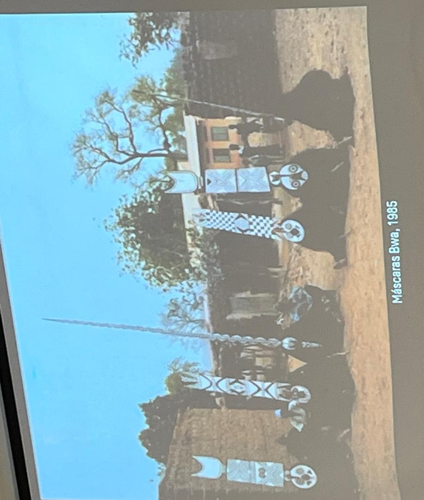

- A) Mossi
- B) Lobi
- C) Senufo
- D) Bwa / Nunuma

▶ Ver respuesta

**Respuesta: D) Bwa / Nunuma** (Burkina Faso). Máscaras "tabla" verticales u horizontales, con formas geométricas y media luna; **ojos en círculos concéntricos**. Función de **fertilidad** y de alejar malos espíritus, en la temporada seca.

---

### 8. Esta máscara con cuernos de toro reales, que NO es facial (se lleva sobre la frente), pertenece a una comunidad de las islas Bissagos. ¿Cuál?

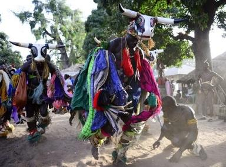

- A) Bidyogo / Bigyodo (Guinea-Bisáu)
- B) Mende (Sierra Leona)
- C) Dan (Costa de Marfil)
- D) Baulé (Costa de Marfil)

▶ Ver respuesta

**Respuesta: A) Bidyogo / Bigyodo** (Guinea-Bisáu, **islas Bissagos**). Máscara de **toro** con cuernos reales, usada en **rituales de iniciación masculina**; **no es facial** (va en la frente). El toro simboliza la fuerza.

---

### 9. Esta máscara-casco negra, de ojos casi cerrados y cuello con anillas, es excepcional porque **la llevan mujeres**. ¿De qué pueblo es?

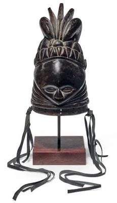

- A) Yoruba (Gelede)
- B) Igbo (Agbogho Mmwo)
- C) Mende (sociedad Sande)
- D) Gouro (Zaouli)

▶ Ver respuesta

**Respuesta: C) Mende** (Sierra Leona). Máscara **Bundu / Sowei** de la sociedad femenina **Sande** (iniciación femenina). Es la **excepción**: son **las mujeres** quienes las llevan. Las anillas del cuello evocan las ondas del agua (los ancestros viven en los ríos).

---

### 10. Esta máscara roja de frente abombada y grandes ojos, usada en carreras (función lúdica), pertenece al pueblo Dan. ¿Cómo se denomina?

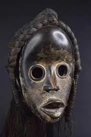

- A) Máscara Zamble
- B) Máscara gunyega (de corredor)
- C) Máscara Goli kple-kple
- D) Máscara Tantanua

▶ Ver respuesta

**Respuesta: B) Máscara gunyega** o "de corredor" (pueblo **Dan**, oeste de Costa de Marfil y Liberia). Función **lúdica** (en el pasado, entrenamiento para la guerra); carreras en zigzag en la estación seca. (Otra máscara Dan con tela roja avisa de incendios.)

---

### 11. Esta máscara con caolín blanco, ideal de belleza femenina, se usa en la "fiesta anual de las doncellas" del pueblo Igbo. ¿Cuál es?

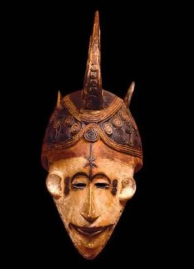

- A) Máscara Gelede
- B) Máscara Satimbe
- C) Máscara Sowei
- D) Máscara Agbogho Mmwo

▶ Ver respuesta

**Respuesta: D) Agbogho Mmwo** (pueblo **Igbo**, Nigeria). Representa el ideal de belleza y moral femenina; el **caolín blanco** = pureza/ancestros. Se usa en la **fiesta anual de las doncellas**, en época seca.

---

### 12. Estas figuras grotescas con actitud mendicante (cuenco/huevo) que "protegen el poblado" son del pueblo Baulé. ¿Cómo se llaman?

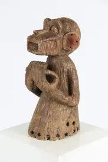

- A) Monos Mbra
- B) Blolo Bian
- C) Tugubele
- D) Bateba

▶ Ver respuesta

**Respuesta: A) Monos Mbra** (pueblo **Baulé**, Costa de Marfil). Figuras grotescas que **generan temor**, protegen el poblado y evitan energías negativas; actitud **mendicante** (sostienen un cuenco con un huevo).

---

### 13. Este relicario de núcleo de madera **revestido de planchas de metal** y tocado en media luna procede de Gabón-Congo. ¿De qué etnia es?

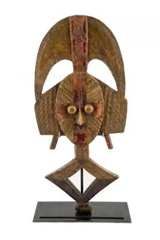

- A) Fang (Eyema Byeri)
- B) Songye
- C) Kota
- D) Teke

▶ Ver respuesta

**Respuesta: C) Kota** (Gabón y Congo). A diferencia del relicario **Fang** (*Eyema Byeri*, en madera), el **Kota** tiene un núcleo de madera **recubierto de planchas de metal**, es más grande y presenta rostro cóncavo/convexo con tocado en media luna. (Distinguir Fang vs Kota es típico de examen.)

---

### 14. Estas máscaras altas y cónicas pertenecen a una sociedad secreta masculina (religión + poder político) del pueblo Tolai. ¿Qué sociedad es?

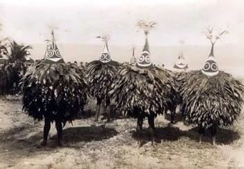

- A) Sociedad Sande
- B) Sociedad Duk-Duk (Nueva Bretaña)
- C) Sociedad Malangan
- D) Sociedad Potlatch

▶ Ver respuesta

**Respuesta: B) Sociedad Duk-Duk** (Nueva Bretaña, archipiélago Bismarck; pueblo **Tolai**). Sociedad secreta masculina que combina **religión, poder político y control social**; las máscaras encarnan **espíritus** que dictan las normas. (Imagen marcada como importante en el temario.)

---

### 15. Estas figuras de proa de canoa, vinculadas a la caza de cabezas, son de las Islas Salomón. ¿Cómo se llaman?

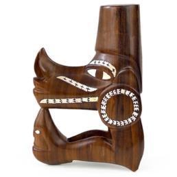

- A) Bisj
- B) Tiki
- C) Moai
- D) Nguzunguzu / musumusu

▶ Ver respuesta

**Respuesta: D) Nguzunguzu / musumusu** (Islas Salomón). Figuras situadas en la **proa de las canoas**, relacionadas con la **caza de cabezas**.

---

### 16. Esta figura divina hueca, cubierta por unas 30 pequeñas figuras y conservada en el British Museum, procede de la isla de Rurutu. ¿Cuál es?

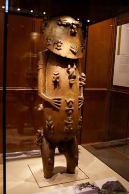

- A) A'a
- B) Tiki
- C) Kava Kava
- D) Rambaramp

▶ Ver respuesta

**Respuesta: A) A'a** (archipiélago de las Australes, isla **Rurutu**, Polinesia). "Cumbre del arte oceánico": figura divina antropomorfa cubierta por **~30 figuras**, hueca y con tapa en la parte trasera; hoy en el **British Museum**.

---

### 17. Estas esculturas monumentales, datadas entre los s. XII y XVII y dispuestas "de espaldas al mar", son de Rapa Nui. ¿Cómo se denominan?

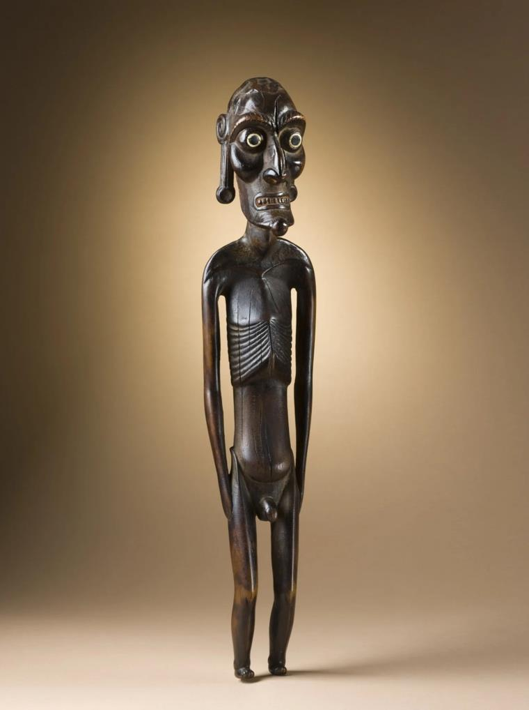

- A) Tiki
- B) Kava Kava
- C) Moai
- D) Bisj

▶ Ver respuesta

**Respuesta: C) Moai** (Isla de Pascua / **Rapa Nui**). Cronología s. XII–XVII, situados de espaldas al mar. La isla, descubierta en 1722 por Jakob Roggeveen, tiene la **única escritura** de la zona (sin descifrar). (La figura Kava Kava es otra pieza de Rapa Nui.)

---

### 18. Esta figura antropomorfa procede de las Islas Marquesas (Polinesia). ¿Qué nombre recibe?

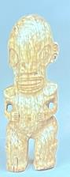

- A) Moai
- B) Tiki
- C) A'a
- D) Nevimbumbao

▶ Ver respuesta

**Respuesta: B) Tiki** (Islas Marquesas, Polinesia). Figura antropomorfa característica de la región.

---

## PARTE 2 — Conceptos y contenido

### 19. El arte de estos pueblos se define principalmente como:

- A) Arte autónomo, con valor estético en sí mismo
- B) Arte decorativo de élites urbanas
- C) Arte exclusivamente funerario
- D) Arte heterónomo, al servicio de una función ritual o social

▶ Ver respuesta

**Respuesta: D)** Es un **arte heterónomo**: está al servicio de una **función** (ritual, social), no del disfrute estético. Se sustenta en el **animismo** (todo tiene espíritu/alma).

---

### 20. ¿Qué disciplina **compara** una o varias culturas (incluso de distintos países)?

- A) Etnología
- B) Etnografía
- C) Antropología
- D) Arqueología

▶ Ver respuesta

**Respuesta: A) Etnología** (compara culturas). La **etnografía** describe las costumbres de **una** etnia (trabajo de campo); la **antropología** estudia al hombre y surge en el s. XIX.

---

### 21. El término "primitivo", acuñado en el s. XIX, hoy se considera:

- A) Un término neutro y vigente
- B) Un sinónimo de "prehistórico"
- C) Un término peyorativo, sin validez actual
- D) Un concepto puramente geográfico

▶ Ver respuesta

**Respuesta: C)** Es un término **peyorativo** del s. XIX (culturas "inferiores") que **hoy no tiene validez**. Obra clave: Edward B. Tylor, *Cultura primitiva* (1871).

---

### 22. La pátina **costrosa** de una escultura africana indica que la pieza:

- A) No ha recibido sacrificios (se trata con aceite de palma)
- B) Ha recibido sacrificios o libaciones
- C) Es una falsificación reciente
- D) Pertenece a una sociedad jerárquica

▶ Ver respuesta

**Respuesta: B)** La pátina **costrosa** = ha recibido **sacrificios/libaciones** (p. ej. Lobi, Ikenga). La pátina **brillante/limpia** = no los recibe (p. ej. Tugubele Senufo).

---

### 23. La llamada "proporción africana" se refiere a que:

- A) Las figuras son siempre simétricas
- B) Las piernas son más largas que el tronco
- C) El cuerpo se representa a tamaño natural
- D) La cabeza ocupa 1/3 o 1/4 del cuerpo (desproporcionadamente grande)

▶ Ver respuesta

**Respuesta: D)** La **cabeza** equivale a **1/3 o 1/4** del cuerpo (desproporcionadamente grande) por ser la parte más importante (pensamiento/emoción).

---

### 24. ¿Qué define mejor a una máscara africana en este contexto?

- A) "La representación visible de lo invisible": el portador encarna un espíritu/antepasado
- B) Un objeto decorativo de uso cotidiano
- C) Un retrato realista del difunto
- D) Un distintivo de rango militar

▶ Ver respuesta

**Respuesta: A)** La máscara es **"la representación visible de lo invisible"**: objeto sagrado en el que el portador deja de ser él mismo y **encarna un espíritu/antepasado** (alter ego). Se hace en secreto, en el bosque.

---

### 25. La Conferencia de Berlín (1885), que repartió África entre las potencias europeas, fue convocada por:

- A) Napoleón III
- B) James Cook
- C) Bismarck
- D) Leopoldo II

▶ Ver respuesta

**Respuesta: C) Bismarck** (1885). Participaron 12 naciones europeas + Turquía + EE.UU. Inicialmente solo colonizan el **litoral**, hasta que la **vacuna de la malaria** les permite entrar al interior.

---

### 26. La religión **Vudú** se localiza principalmente en:

- A) El Reino de Benín (Nigeria)
- B) La República de Benín y Togo (etnias Ewe y Fon)
- C) Ghana y Costa de Marfil
- D) El Congo

▶ Ver respuesta

**Respuesta: B)** El Vudú está en la **República de Benín y Togo** (¡no el *Reino* de Benín, que estaba en Nigeria!), con las etnias **Ewe y Fon**. Espíritus = *loas* o *vudú*. Pasó a América con el comercio de esclavos.

---

### 27. ¿Quién está considerado el **primer artista** en contacto con el arte primitivo, viajando a Tahití?

- A) Henri Matisse
- B) Pablo Picasso
- C) Georges Braque
- D) Paul Gauguin

▶ Ver respuesta

**Respuesta: D) Paul Gauguin**, primer artista en contacto con el arte primitivo (Tahití). Obras: *La Orana María*, *Matamúa*. Descubrió que esas culturas ya estaban "contaminadas" por Occidente.

---

### 28. En la relación de las vanguardias con el arte primitivo, la diferencia clave entre Picasso y Matisse es que:

- A) Picasso descompone por la FORMA/dibujo y Matisse por el COLOR
- B) Picasso descompone por el COLOR y Matisse por la FORMA
- C) Ambos trabajan únicamente la escultura
- D) Ninguno tuvo contacto con piezas africanas

▶ Ver respuesta

**Respuesta: A)** **Picasso descompone por la FORMA/dibujo** (*Las señoritas de Avignon*, 1907; influencia de la máscara Ngil Fang, Pende, Songye…), mientras que **Matisse** lo hace por el **COLOR** (adquirió un fetiche Vili del Congo en 1905).

---

### 29. La película *Las estatuas también mueren* (Chris Marker y Alain Resnais, 1953):

- A) Es una comedia sobre coleccionistas
- B) Fue un encargo de *Présence Africaine* y estuvo censurada 12 años
- C) Es un documental neutral sin crítica
- D) Trata sobre el arte egipcio

▶ Ver respuesta

**Respuesta: B)** Encargo de la revista **Présence Africaine**; excede el documental de arte para ser un **ensayo fílmico de crítica** al colonialismo y a la mercantilización del arte. Estuvo **censurada 12 años**.

---

### 30. Ordena cronológicamente (de más antigua a más reciente) estas culturas:

- A) Benín → Nok → Ife → Djenné-Djeno
- B) Nok → Djenné-Djeno → Ife → Benín
- C) Ife → Nok → Benín → Djenné-Djeno
- D) Djenné-Djeno → Nok → Benín → Ife

▶ Ver respuesta

**Respuesta: B) Nok → Djenné-Djeno → Ife → Benín**. Nok (desde ~1000 a.C.) es la más antigua; Djenné-Djeno (desde s. III a.C.); Ife (piezas s. XII–XV); Reino de Benín (inicio s. XIII, esplendor XV–XVI).

---

### 31. En el Reino de Benín, ¿qué material era de uso **exclusivo del Oba** (rey)?

- A) El bronce
- B) El oro
- C) El marfil
- D) La terracota

▶ Ver respuesta

**Respuesta: C) El marfil** era material **exclusivo del Oba**. (Las cabezas y placas conmemorativas son de **bronce**; el **oro** es más propio del reino **Asante** de Ghana.)

---

### 32. En el reino **Asante / Ashanti** (Ghana), el objeto que simboliza el alma de la nación y que, según el mito, cayó del cielo es:

- A) El taburete de oro
- B) El disco del alma
- C) La muñeca akuaba
- D) La espada akrafena

▶ Ver respuesta

**Respuesta: A) El taburete de oro**, vinculado al fundador **Osei Tutu**; según el mito cayó del cielo y representa el **alma de la nación**. El Asante destaca por el **oro** (capital Kumasi; grupo mayor: los Akan).

---

### 33. La máscara **N'Tomo** del pueblo Bamana/Bambara se caracteriza por:

- A) Tener una doble cruz
- B) Representar una pareja de antílopes
- C) Carecer de boca (saber callar), con 3–8 cuernos
- D) Estar hecha de cestería

▶ Ver respuesta

**Respuesta: C)** La **N'Tomo** es facial, con 3–8 cuernos y **sin boca** (simboliza el saber callar); ceremonia secreta de iniciación. La pareja de **antílopes** corresponde a la máscara cimera **Ci Wara** (fertilidad del mijo).

---

### 34. La sociedad femenina **Sande** y la excepción de que sean **mujeres** quienes portan la máscara corresponde al pueblo:

- A) Yoruba
- B) Mende
- C) Dogon
- D) Fang

▶ Ver respuesta

**Respuesta: B) Mende** (Sierra Leona), sociedad **Sande**, máscara casco **Bundu/Sowei**. Es la **excepción**: normalmente las máscaras las llevan **hombres** aunque la ceremonia sea de/para mujeres (p. ej. Gelede Yoruba).

---

### 35. Las efigies de **gemelos** Ibeji (Yoruba), Venavi (Ewe) y Hohovi (Fon) se honran a raíz del veredicto del oráculo:

- A) Esu
- B) Olodumare
- C) Amma
- D) Ifá / Fa

▶ Ver respuesta

**Respuesta: D) Ifá / Fa**. África occidental tiene un altísimo índice de gemelos; antes los mataban y, tras el **oráculo Ifá**, pasaron a honrarse. Si uno muere, se talla una efigie para que su alma se encarne.

---

### 36. La cabaña de barro **"tolke"**, con planta circular, óculo de salida de humos y nervios en V que permiten construir sin andamios, es propia de los:

- A) Musgum (Camerún)
- B) Dogon (Malí)
- C) Fang (Gabón)
- D) Bambara (Malí)

▶ Ver respuesta

**Respuesta: A) Musgum** (Camerún). Los **nervios en V** refuerzan la estructura, permiten **subir sin andamios** y evacúan el agua. (Muy de examen.)

---

### 37. Para el pueblo **Asmat** (Papúa Occidental), el mundo de los ancestros recibe el nombre de *safan* y se localiza en:

- A) Las copas de los árboles
- B) Las montañas
- C) El mar y los ríos
- D) El subsuelo

▶ Ver respuesta

**Respuesta: C) El mar y los ríos**. Los ancestros (*safan*) viven en el mar/ríos; el héroe creador es **Fumeripitsj**; el **árbol = ser humano**. La ceremonia para honrar a los muertos es la **Jipae**.

---

### 38. La figura femenina mítica **Nevimbumbao** (Vanuatu) es relevante porque:

- A) Está en el British Museum desde el s. XIX
- B) Picasso la recibió de Matisse en 1954 (a su muerte)
- C) Fue tallada por Gauguin
- D) Es el origen del cubismo

▶ Ver respuesta

**Respuesta: B)** La **Nevimbumbao** (mujer mítica de Malekula, Vanuatu) fue recibida por **Picasso de manos de Matisse en 1954**, al morir este. En Vanuatu existe además la "sociedad de grados" (el **cerdo** permite ascender).

---

### 39. Entre los **Inuit**, el objeto de piedra situado en el centro del iglú que da calor, cocina y seca las pieles es:

- A) La máscara de dedos
- B) El tupiq
- C) El qargi
- D) La lámpara qulliq

▶ Ver respuesta

**Respuesta: D) La lámpara qulliq** (de piedra). Otro elemento clave del temario es la **máscara de dedos** (s. XIX). El *tupiq* es la tienda de verano y el *qargi* la casa de los hombres.

---

### 40. En la **costa noroeste** de Norteamérica, la ceremonia de intercambio de regalos que legitima ritos y jerarquía (competición de generosidad) es:

- A) El Potlatch
- B) La Kachina
- C) La Danza del Sol
- D) El Yeibichei

▶ Ver respuesta

**Respuesta: A) El Potlatch** (p. ej. Tlingit): intercambio de regalos que **legitima** ritos (matrimonios…) y la **jerarquía**, en clave de competición de generosidad. El clima oceánico (salmón) genera excedente → mayor sedentarización y jerarquía.

---

### 41. En la costa noroeste, el **tótem** debe entenderse como:

- A) Un simple poste decorativo
- B) Un calendario astronómico
- C) El blasón del clan (deidades, no el animal sin más)
- D) Una tumba individual

▶ Ver respuesta

**Respuesta: C)** El tótem (asociado sobre todo a los **Haida**) es el **blasón del clan** (deidades). Los sombreros/cestas de fibra entrelazada también identifican la zona noroeste.

---

### 42. La **máscara doble** o de transformación (que al abrirse pasa de espíritu animal a humano) es característica del pueblo:

- A) Haida
- B) Kwakiutl
- C) Navajo
- D) Hopi

▶ Ver respuesta

**Respuesta: B) Kwakiutl**. La **máscara doble/de transformación** se abre para pasar del espíritu animal al humano (ceremonia **Tl'asalas**, matrimonio). Artista citado: Lelooska Smith.

---

### 43. En el suroeste norteamericano, ¿qué pueblo enseñó el **textil** a los Navajos (que después lo perfeccionaron)?

- A) Los Zuñi
- B) Los Apache
- C) Los Mogollón
- D) Los Hopi

▶ Ver respuesta

**Respuesta: D) Los Hopi** (matrilineales, exógamos) enseñaron el **textil** a los **Navajos**, que lo **mejoraron**. Los Hopi destacan también por las **muñecas kachina**.

---

### 44. La cerámica con el diseño del **venado con una línea hasta el corazón** (en señal de respeto al animal) es propia del pueblo:

- A) Zuñi
- B) Mogollón (estilo Mimbres)
- C) Apache
- D) Navajo

▶ Ver respuesta

**Respuesta: A) Zuñi**. Cerámica con el motivo del **venado con línea hasta el corazón** (respeto al animal). (El estilo **Mimbres**, de los **Mogollón**, "mata" la pieza perforándola.)

---

### 45. En las **Praderas**, el animal considerado "motor de la vida" (piel para el tipi, cuernos para cucharas…) y el espíritu vital supremo son, respectivamente:

- A) El caribú y Sedna
- B) El antílope y Amma
- C) El bisonte y Wakan Tanka (Gran Espíritu)
- D) El cocodrilo y Fumeripitsj

▶ Ver respuesta

**Respuesta: C)** El **bisonte** es el "motor de la vida" de los nómadas de las Praderas; el espíritu vital supremo es **Wakan Tanka** (Gran Espíritu). La cosmovisión se organiza por ciclos de 4 y de 7.

---

## Plantilla de soluciones

| # | Resp | # | Resp | # | Resp |
|---|------|---|------|---|------|
| 1 | C | 16 | A | 31 | C |
| 2 | B | 17 | C | 32 | A |
| 3 | D | 18 | B | 33 | C |
| 4 | A | 19 | D | 34 | B |
| 5 | C | 20 | A | 35 | D |
| 6 | B | 21 | C | 36 | A |
| 7 | D | 22 | B | 37 | C |
| 8 | A | 23 | D | 38 | B |
| 9 | C | 24 | A | 39 | D |
| 10 | B | 25 | C | 40 | A |
| 11 | D | 26 | B | 41 | C |
| 12 | A | 27 | D | 42 | B |
| 13 | C | 28 | A | 43 | D |
| 14 | B | 29 | B | 44 | A |
| 15 | D | 30 | B | 45 | C |

---

> *Imágenes extraídas de las diapositivas del archivo "PUEBLOS PRIMITIVOS.pdf". Contenido basado en el temario "HISTORIA DEL ARTE DE LOS PUEBLOS PRIMITIVOS.pdf" y en la `GUIA_ESTUDIO.md` del repositorio. Material de uso académico/estudio personal.*
